# 🌌 Aayusha Singh | Astrophysicist & ML Engineer

<div align="center">
  
</div>

<div align="center">
  
</div>

## 🚀 Mission Control

```python
class AstrophysicistProfile:
    def __init__(self):
        self.name = "Aayusha Singh"
        self.current_mission = "B.Tech Mechanical Engineering @ NIT Srinagar"
        self.parallel_universe = "B.Sc Mathematics @ IGNOU"
        self.research_stations = ["IISc Bangalore", "Empire Space Texas"]
        self.specializations = [
            "Stellar Evolution & Supernovae",
            "Dark Matter-Dark Energy Interactions", 
            "Gravitational Wave Analysis",
            "Machine Learning in Astrophysics",
            "Relativistic Spacecraft Dynamics"
        ]
        
    def current_explorations(self):
        return {
            "🔭 Research": "Testing Fuzzball Hypothesis for Black Holes",
            "🤖 AI Projects": "Retina Image Enhancement with Deep Learning",
            "🌌 Publications": "5 Papers Published, 5 Accepted at International Conferences",
            "🛸 Startup": "Founder of Magnetars - Astrophysics Venture"
        }
```

<div align="center">
  
  
</div>

## 🌟 Research Constellation

<div align="center">
  <table>
    <tr>
      <td align="center" width="33%">
        
        <br><b>🔭 Astrophysics</b>
        <br>Stellar Evolution, Supernovae<br>Neutron Stars, Black Holes<br>Dark Matter & Energy
      </td>
      <td align="center" width="33%">
        
        <br><b>🤖 AI/ML</b>
        <br>Deep Learning for Space Data<br>Bayesian Inference<br>Predictive Modeling
      </td>
      <td align="center" width="33%">
        
        <br><b>🚀 Space Tech</b>
        <br>Spacecraft Dynamics<br>Relativistic Effects<br>Interstellar Travel
      </td>
    </tr>
  </table>
</div>

## 🛠️ Technology Arsenal

<div align="center">
  
</div>

### 🔬 Scientific Computing
- **Languages**: Python, C++, JavaScript, MATLAB
- **ML/AI**: TensorFlow, PyTorch, Scikit-learn, Keras
- **Astrophysics**: SymPy, AstroPy, SciPy, NumPy
- **Visualization**: Matplotlib, Seaborn, Plotly, p5.js

### 🌐 Development Stack
- **Web**: React.js, Django, Flask, HTML5, CSS3
- **Database**: MySQL, PostgreSQL, MongoDB
- **Tools**: Git, Docker, AWS, Selenium, BeautifulSoup

## 📊 GitHub Galaxy Stats

<div align="center">
  
</div>

<div align="center">
  
</div>

## 🏆 Achievement Unlocked

<div align="center">
  
</div>

## 📚 Recent Publications & Research

### 🌌 Latest Papers (2024-2025)
- **"Influence of Interactions between Dark Energy and Dark Matter on Galaxy Formation"** - *IJASEAT*
- **"Testing Fuzzball Hypothesis for Black Holes: A Gravitational Wave Analysis"** - *EAS 2025*
- **"Bayesian Hierarchical Inference of Star Cluster Parameters Using Gaussian Process Regression"** - *Bridging Scales, Italy*
- **"Extreme Astrophysical Emissions in Pulsars, Magnetars, and Black Holes"** - *ICRC 2025, CERN*

### 🚀 Current Projects

```mermaid
graph TD
    A[🔭 Astrophysics Research] --> B[Black Hole Physics]
    A --> C[Stellar Evolution]
    A --> D[Dark Matter Studies]
    
    E[🤖 AI/ML Projects] --> F[Retina Image Enhancement]
    E --> G[Plant Disease Classification]
    E --> H[Cosmic Ray Analysis]
    
    I[🛸 Space Tech] --> J[Spacecraft Dynamics]
    I --> K[Relativistic Effects]
    I --> L[Interstellar Travel]
```


## 🌍 Professional Network

<div align="center">
  <a href="mailto:singh.aayushaa@gmail.com">
    
  </a>
  <a href="https://github.com/aayu-sha">
    
  </a>
  <a href="https://www.linkedin.com/in/aayusha-singh">
    
  </a>
  <a href="https://orcid.org/0009-0008-7361-2813">
    
  </a>
  <a href="https://scholar.google.com/citations?user=YourGoogleScholarID">
    
  </a>
</div>

## 🎯 Organizations & Memberships

<div align="center">
  <table>
    <tr>
      <td align="center">🔬 <b>International Society for Data Science and Analytics</b></td>
      <td align="center">🌟 <b>International Astronomical Search Collaboration</b></td>
    </tr>
    <tr>
      <td align="center">🚀 <b>Space Generation Advisory Council</b></td>
      <td align="center">🛰️ <b>SSPI - Space & Satellite Professionals International</b></td>
    </tr>
    <tr>
      <td align="center">⚙️ <b>ASME - American Society of Mechanical Engineers</b></td>
      <td align="center">🌍 <b>National Geographic Citizen Scientist</b></td>
    </tr>
  </table>
</div>

## 🌟 Fun Facts About Me

<div align="center">
  
</div>

---

<div align="center">
  
</div>

<div align="center">
  <sub>🌌 "The universe is not only stranger than we imagine, it is stranger than we can imagine." - J.B.S. Haldane</sub>
  <br>
  <sub>⭐ <strong>Visitor Count:</strong> </sub>
</div>