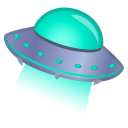

  <h1 style="margin: 0;">  Hi, I’m Aayusha Singh</h1>

  <h2>Visitor's Count</h2>
  

 I’m interested in Astronomy, Astrophysics, Mathematics. Along with all these, I'm deeply interested in Python, Machine Learning, and Artificial Intelligence.

🌱 I’m currently learning Mechanical Engineering at National Institute of Technology Srinagar.

📫 How to reach me: 

    Email: singh.aayushaa@gmail.com

    LinkedIn: aayusha-singh

👽 Pronouns: She/Her

### Tech Stack

- **Programming Languages:** Python, JavaScript, HTML, CSS, PHP, Java, C++, C

- **Frameworks/Libraries:** Django, Flask, React.js

- **Data Science/ML:** Pandas, NumPy, Scikit-learn, TensorFlow

- **Database:** MySQL, PostgreSQL, MongoDB

- **Tools/Platforms:** Git, GitHub, Docker, AWS

- **Web Development:** HTML, CSS, Bootstrap, jQuery

  

  

  <a href="mailto:singh.aayushaa@gmail.com" style="display: inline-block; padding: 00px 00px; background-color: #FFA500; color: #FFFFFF; font-size: 18px; border-radius: 5px; text-decoration: none;">
    📧 Email Me
  </a>

